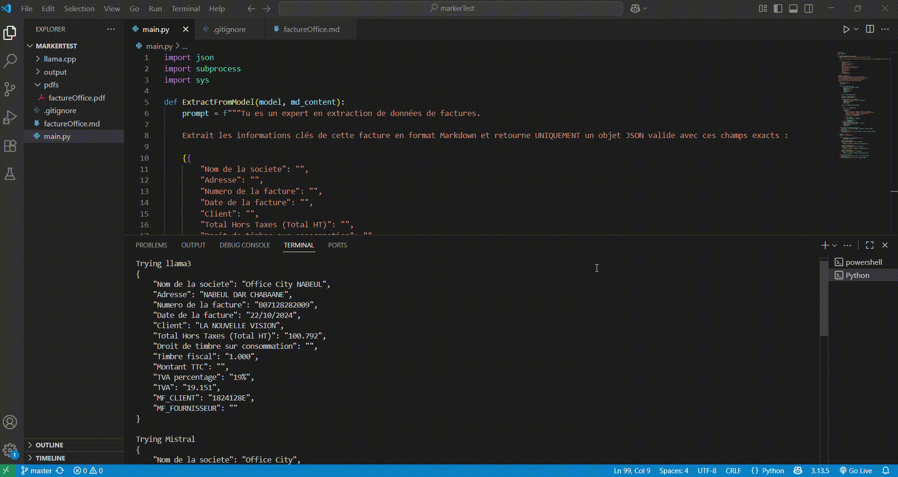

# 📄 AI-Powered Invoice Data Extractor from PDF (Marker + Ollama)

This project automates the extraction of key invoice details from PDF files using a combination of **Marker** for PDF-to-Markdown conversion and **Ollama** for AI-based data parsing.  
It tests **three local LLMs** — **LLaMA 3**, **Mistral**, and **Phi-3** — to compare extraction quality and determine the most accurate model.  
In our evaluation, **LLaMA 3 produced the most consistent and accurate results**.

---
## 🎥 Demo

Here is an example output from each model:

👉 

---
## 🚀 Features
- **Multi-model comparison** (LLaMA 3, Mistral, Phi-3)  
- Works **100% offline** with local models via [Ollama](https://ollama.com/)  
- Cleans and validates JSON output automatically  
- Handles missing fields gracefully by returning empty strings  
- Protects sensitive data — no cloud API calls  
- Fully customizable for other document types

---

## 🛠 How It Works
1. **Marker** converts a PDF invoice to clean Markdown.  
2. The script sends the Markdown to each model via Ollama.  
3. Each model is prompted to return **only valid JSON** with the following fields:
   ```json
   {
       "Nom de la societe": "",
       "Adresse": "",
       "Numero de la facture": "",
       "Date de la facture": "",
       "Client": "",
       "Total Hors Taxes (Total HT)": "",
       "Droit de timbre sur consommation": "",
       "Timbre fiscal": "",
       "Montant TTC": "",
       "TVA percentage": "",
       "TVA": "",
       "MF_CLIENT": "",
       "MF_FOURNISSEUR": ""
   }


## ⚙️ Installation & Usage

1️. Install Ollama and download the models

```bash
ollama pull llama3
ollama pull mistral
ollama pull phi3
```

2️. Install Marker (for PDF → Markdown)

```bash
pip install marker-pdf
```

3. Convert your invoice PDF to Markdown:
   
```bash
marker invoice.pdf facture.md
```

