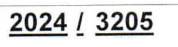

162.19.106.61 RC.: B07128282009

Mat Fisc.: 1105007 **T/B/E 001** 

Dépôt de livraison: 1

Office City NABEUL

## **FACTURE N°:**

 $\mathbf{S}$ 

| LE           | ÷.                   | 22/10/2024         | Page: |  |
|--------------|----------------------|--------------------|-------|--|
| Code Client: |                      | 1824128E           |       |  |
| Client       |                      | LA NOUVELLE VISION |       |  |
| Adresse      | $\ddot{\phantom{a}}$ | NABEUL             |       |  |
| Ville        | $\ddot{\phantom{a}}$ | DAR CHABAANE       |       |  |
| N°Contact:   |                      | 56800800           |       |  |
| Mat.Fiscale: |                      | 1824128EAM000      |       |  |

| CODE          | DESIGNATION                     | <b>TTVA</b>     | <b>QTE</b>  | P.U.HT | P.U.TTC   | <b>REM</b>        | TOTAL H.T.    | TOTAL   |
|---------------|---------------------------------|-----------------|-------------|--------|-----------|-------------------|---------------|---------|
| 2009000009664 | <b>LUDO NS 2024</b>             | 19.00           | 1.000       | 12.000 | 14.280    |                   | 12.000        |         |
| 6194021300226 | MONOPOLY FRANCAIS GM REF 20     | 19.00           | 1.000       | 21.040 | 25.038    |                   | 21.040        |         |
| 6194021300158 | JEUX DE SCRABBLE FR DE LUXE     | 19.00           | 1.000       | 16.034 | 19.080    |                   | 16.034        |         |
| 6194021300288 | JEUX DE DAME ECHEC CRISTAL A    | 19.00           | 1.000       | 18.525 | 22.045    |                   | 18.525        |         |
| 6193608300017 | <b>JEU BUSINESS IS BUSINESS</b> | $19.00 -$       | 1.000       | 33.193 | 39.500    |                   | 33.193        |         |
| $p_{\mu}$ .   | $\sim$                          |                 |             |        |           |                   |               |         |
|               | CACHET ET SIGNATURE             | <b>ASSIETTE</b> | <b>TAUX</b> |        | MONT. TVA | TOTAL H.T.:       |               | 100.792 |
|               |                                 |                 |             |        |           | NET H.TVA :       |               | 100.792 |
|               |                                 |                 |             |        |           | <b>TOTAL TVA:</b> |               | 19.151  |
|               |                                 |                 |             |        |           |                   | TIMBRE FIS. : | 1.000   |
|               |                                 | 100.792         | 19%         |        | 19.151    |                   |               |         |
|               |                                 |                 |             |        |           | NET T.T.C.        |               | 120.943 |

ARRETEE LA PRESENTE FACTURE A LA SOMME DE : cent vingt DINARS, neuf cent quarante trois MILLIMES